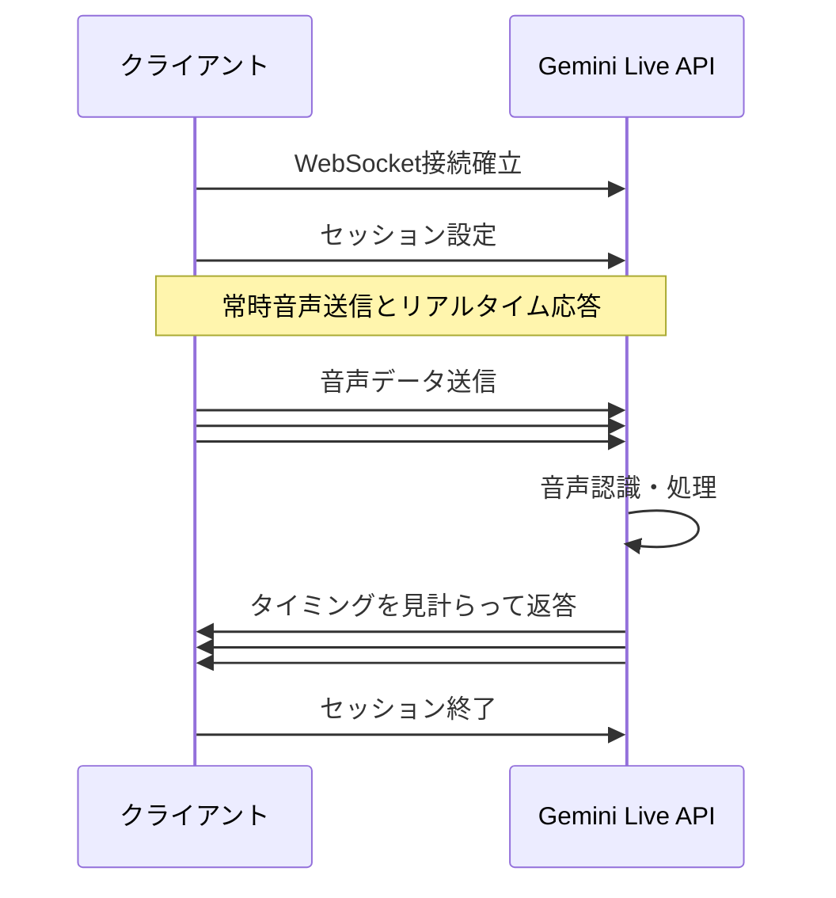

## はじめに

### 概要

私のチームでは、チーム内プロジェクトとして XR・AI 連携のユースケースを探るためのプロトタイプを開発しています。
本記事では、その試行の中で生まれた WhatsThis AI という WebAR アプリにおける GeminiAPI の活用にフォーカスして技術解説をしていきます。

### 対象読者

本記事では、主に次のような方々に刺さるといいなぁと意識しながら書いてみましたが、内容に知識や文脈を多く必要とするわけではないので、その限りではありません。

- XR と AI を組み合わせたアプリケーションの事例に興味がある方
- GeminiAPI の機能と実装方法が知りたい方

### 開発環境

WhatsThis AI の開発環境を次に示します。

- 8thwall クラウドエディタ
  - 8thwall Engine 27.4.8.427
  - React/react-dom v17
- Gemini API
  - `gemini-2.0-flash-live-001`
  - `gemini-2.0-flash-001`

## プロジェクト概要と技術構成の概観

### WhatsThis AIの概要

WhatsThis AI は、 AI と AR を掛け合わせた音声ガイド LINE ミニアプリです。LINE ミニアプリとありますが、その実態は Web アプリとなっています（LINE ミニアプリに関しては今回の趣旨とは離れるので割愛します）。

WhatsThis AI を使って AI と対話すると、カメラ画像に映っている場所であったり物の使い方であったりを説明してくれるだけでなく、適当な場所に 3D 矢印やテキストを配置することで、より分かりやすくする機能があります。
たとえば外国で電車に乗ろうとしたときに券売機の使い方が分からなかったとしましょう。そんな時、WhatsThis AI を起動して券売機を映して質問をすると、手続きに必要なボタンの場所を 3D テキストで表示しながら AI が説明してくれる、といったような使い方を想定しています。
<!-- textlint-disable -->
＜動画か画像など貼りたい＞
<!-- textlint-enable -->

### 利用技術

利用技術とざっくりと列挙すると次のようになります。

- 8thwall
- React / React Router / MaterialUI
- Gemini Developer API（以降 Gemini API）

開発環境の部分で既にふれている通り、WhatsThis AI は 8thwall で開発されています。
8thwall は Niantic Spatial 社が開発している WebAR アプリケーションを開発するためのフレームワークで、それと一緒にブラウザ上で開発ができる「クラウドエディタ」も提供されています。
今回はクラウドエディタ上で TypeScript を使って開発しています。

https://www.8thwall.com/

WhatsThis AI には AR シーン以外にもボタンやテキストなどの UI 要素もあり、それらの実装には React を使用しています。
現在の Web フロントエンド開発では React のような UI フレームワークを組み込むことは一般的になっていますが、8thwall（特にクラウドエディタ）アプリでは少し特殊というか、工夫が必要になってきます。8thwall エディタプロジェクトで React を使った所感は次の記事に載せています。

https://zenn.dev/hololab/articles/about-react-in-8thwall-editor

WhatsThis AI の、AI による応答の部分は Gemini API を用いました。他にもいろいろ選択肢はありそうですが、対話型のエージェントを実装するのに後述する Live API が相性が良かったのと、現状アプリに組み込むってなったときに Gemini API がちょうど良さそうだったのが理由です。


## Gemini APIについて

ご存じの方も多そうですが、Gemini API は Google によって開発された LLM です。テキストによる入出力だけでなく、画像・音声・動画・ドキュメントファイルなど様々な入力を受け付けられたり、高品質な画像・音声の生成も可能となっていたりしているため、マルチモーダルな LLM であるという特徴があります。
Gemini の機能には Web アプリやモバイルアプリなどからアクセスできるほか API や SDK が提供されており、開発者が自分のアプリに Gemini の機能を組み込むことも可能です。

https://ai.google.dev/gemini-api/docs?hl=ja

Gemini API の基本機能は特定のエンドポイントに HTTP の POST リクエストを送ると利用可能なのでとてもシンプルですが、今回使用した常時接続型の Live API については WebSocket で通信することになります。
また、Google が公式で提供している SDK もありますので、それを使えば難しいことは考えずに使えるでしょう。

ちなみに、WhatsThis AI は 8thwall クラウドエディタ上で開発しているため、外部の npm パッケージをインストールして使うことはできないので、通信部分は自前で実装しています（と言ってもそんな難しいわけではないですが）。

次のコードは、SDK を使わずに Web フロントエンドから GeminiAPI を呼び出す例です。

```ts: Gemini APIを呼び出すTypeScriptのコード例
const apiKey = "<API KEY>";
const apiVersion = "v1beta";
const modelName = "gemini-2.5-flash";
const url = `https://generativelanguage.googleapis.com/${apiVersion}/models/${modelName}:generateContent`;
const requestBody = {
  contents: [{ parts: [{ text: "あなたの名前は何ですか？" }] }],
};

const res = await fetch(url, {
  method: "POST",
  headers: {
    "Content-Type": "application/json",
    "X-goog-api-key": apiKey,
  },
  body: JSON.stringify(requestBody),
}).then((res) => res.json());

const answer = res?.candidates?.[0]?.content?.parts?.[0]?.text;
console.log(answer); // -> 私はGoogleによってトレーニングされた、大規模言語モデルです。
```

## LiveAPIによるAIとのリアルタイムな対話

WhatsThis AI ではエージェントと音声を介して会話できます。動作しては GeminiAPI へ単発の音声データを送って応答を待つのではなく、常時音声を送信し、AI が応答タイミングを自動的に判断してデータを返してくる形になります。
これを実現しているのが、Gemini Live API という機能です。

### Live APIとは

Live API は GeminiAPI の強力な機能の 1 つで、（先述のとおりですが）クライアントと LLM 間で常時接続されている状態を実現できます。

https://ai.google.dev/gemini-api/docs/live

Live API で音声による対話をする場合の処理フローを次の図に示します（ざっくりですが）。



### WhatsThis AIとLive APIの相性

図を見ると分かるのですが、単発のリクエストではなく連続的に音声のデータチャンクを一方的に投げた後に、よしななタイミングで Gemini からも連続的な音声のデータチャンクが通知されていますね。

このように細切れのフレームで送受信されるのが LiveAPI の特徴であり、AI と一定時間何回かに分けて対話するといった用途にマッチしています。
そしておそらく応答スピードも速く、所感として比較的短めのレスポンスを返すことが多いように見受けられます。

また、LiveAPI には Intrupt という機能があり、Gemini から細切れの返答データが返ってきている途中で自分が話し始めると、Gemini が「話が途中で遮られた」ことを検知して話すのをやめます。ちょっと人間っぽいですね（人によっては嫌がられそうですが）。

### Live APIで使えるモデル

執筆時点（2025/07）では次のようなモデルが使用可能です。

- `gemini-2.0-flash-live-001`
  - 一番安定している印象があります
- `gemini-live-2.5-flash-preview`
  - 命名規則が変則ですが、これで合ってるっぽいです
- `gemini-2.5-flash-preview-native-audio-dialog`
  - thinking 対応モデルもあり

### カメラ画像と音声の送信

Live API はマルチモーダルなモデルを採用しているため、次の 3 種類のデータを入力できます。

- テキスト
- 音声
- ビデオ

このうち音声とビデオは「InlineInput」という、テキストとは区別された形式として扱われますが、結局どちらも WebSocket 経由で送信されるのには変わりありません。sned するときのデータ構造が違う感じですね。
WhatsThis AI ではテキストは入力しておらず、音声とビデオを送信し続けています。

音声は PCM16 というフォーマットで送信する必要があります。これはいわゆる音声の生データ（.wav の中身）で、波形の情報が 16bit の整数値でそのまま記録されている形式ですね。サンプリングレートは入力の場合 16kHz である必要があります。
このデータを Base64 エンコードした文字列を、MIME Type（`audio/pcm;rate=16000`）を添えて送信すれば OK です。
データはよしなな長さのチャンクに区切って送信します。

https://ai.google.dev/gemini-api/docs/live-guide#audio-formats

WhatsThis AI では[Live API Web Console](https://github.com/google-gemini/live-api-web-console)の実装を参考にしています。
具体的には Web Audio API からマイク入力を取得し、Audio Worklet 内で Float32Array から Int16Array への変換をして、Base64 エンコードするような実装をしています。

一方ビデオの送信ですが、実態は JPEG 画像です。
つまり、ビデオ（概念）の各フレームを JPEG エンコードしたものをさらに Base64 エンコードして InlineInput として送信します。
WhatsThis AI の実装では、8thwall のカメラのピクセルデータを取得し、非表示状態の Canvas 要素に描画して JPEG/Base64 エンコードしています。


### テキストと音声の受信

クライアントが受信するデータ（つまり Live API から送信されるデータ）は、テキスト・音声が選択可能です。テキスト/音声の選択は、WebSocket のセッションが確立された後に送信する config の Response Modality に設定します。

```ts: Response Modalityの設定
const config = { responseModalities: [Modality.TEXT] };
```

注意すべき点として、（少なくとも執筆時点では）Live API のモデルで Response Modality を複数設定できず、Text or Audio を指定することになります。
API の型情報的には複数できそうですが、おそらくモデルが対応していないんですね。
https://ai.google.dev/gemini-api/docs/live-guide#establish-connection

ところが、WhatsThis AI では AI からの返答を音声で再生しつつ文字でも表示する UI が必要でした。
最初はこの要件を実現するために、「Response Modality は Text にしておいて、受信したあとに Text to Speech を使って音声再生する」という実装をしていました。ちょうど最近、Gemini では TTS 専用のモデルもリリースされていたので試してみたかったのもありますが、さすがにレスポンスが遅く不便でした。

## System Instructionのプロンプトエンジニアリング

### System Instructionとは

### System Instructionによる指示と知識共有

### プロンプトエンジニアリングにおける工夫

## Function Callingを使った空間認識の実行

### FunctionCallingとは

### 空間認識をFunctionCallingで実行したい

### FunctionCallingの処理フロー

## おわりに

